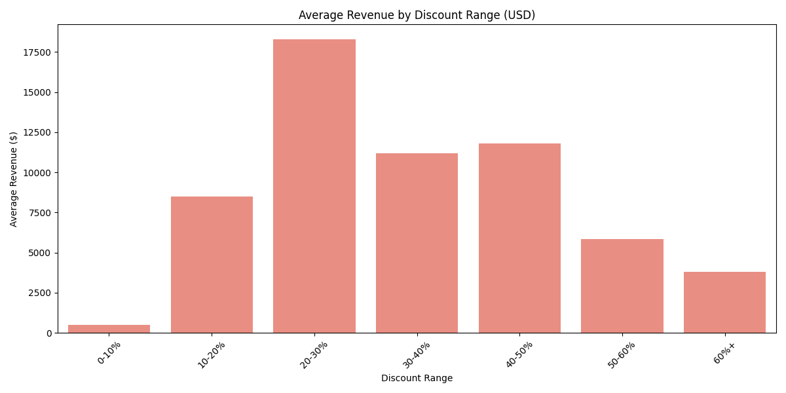

# Amazon Product Discount Effect Analysis

**Sunghun Kim**

Analyzing how discount rates affect revenue, ratings, and review volume on Amazon products.

---

## About

This project explores the relationship between discount percentages and key business metrics (estimated revenue, rating counts, ratings) using a dataset of ~1,465 Amazon India products. Prices are converted from INR to USD for analysis.

The project includes both static visualizations (`matplotlib`) and an interactive dashboard (`Streamlit + Plotly`).

---

## Dataset

- **Source**: Amazon India product listings (Kaggle)
- **Size**: 1,465 products
- **Features**: product name, category, discounted price, actual price, discount percentage, rating, rating count, reviews

---

## Key Findings

### Revenue by Discount Range



Products in the **0–10% discount range** generate the highest average estimated revenue, suggesting that lightly discounted or premium-priced products drive more revenue per unit than heavily discounted ones.

### Distribution of Reviews by Discount Range


The **60%+** and **40–50%** discount ranges attract the most reviews, indicating that deep discounts drive higher purchase volume (using review count as a sales proxy).

### Average Reviews vs Average Rating


---

## Project Structure

```
Amazon-data-analysis-main/
├── main.py              # Entry point — static visualizations
├── dashboard.py         # Streamlit interactive dashboard
├── data_processor.py    # Data loading, cleaning, currency conversion
├── analysis.py          # Discount metric calculations
├── visualizers.py       # Reusable chart functions
├── config.py            # File paths, exchange rate, bin settings
└── amazon.csv           # Dataset
```

---

## How to Run

### Static Analysis
```bash
pip install pandas matplotlib seaborn numpy
python main.py
```

### Interactive Dashboard
```bash
pip install streamlit plotly
streamlit run dashboard.py
```

> **Note**: Update `DATA_PATH` in `config.py` to match your local CSV file path before running.

---

## Tech Stack

- Python 3, Pandas, NumPy
- Matplotlib, Seaborn
- Streamlit, Plotly (dashboard)
