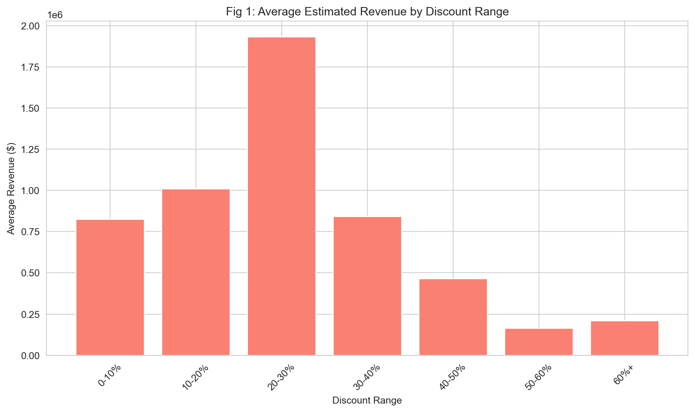
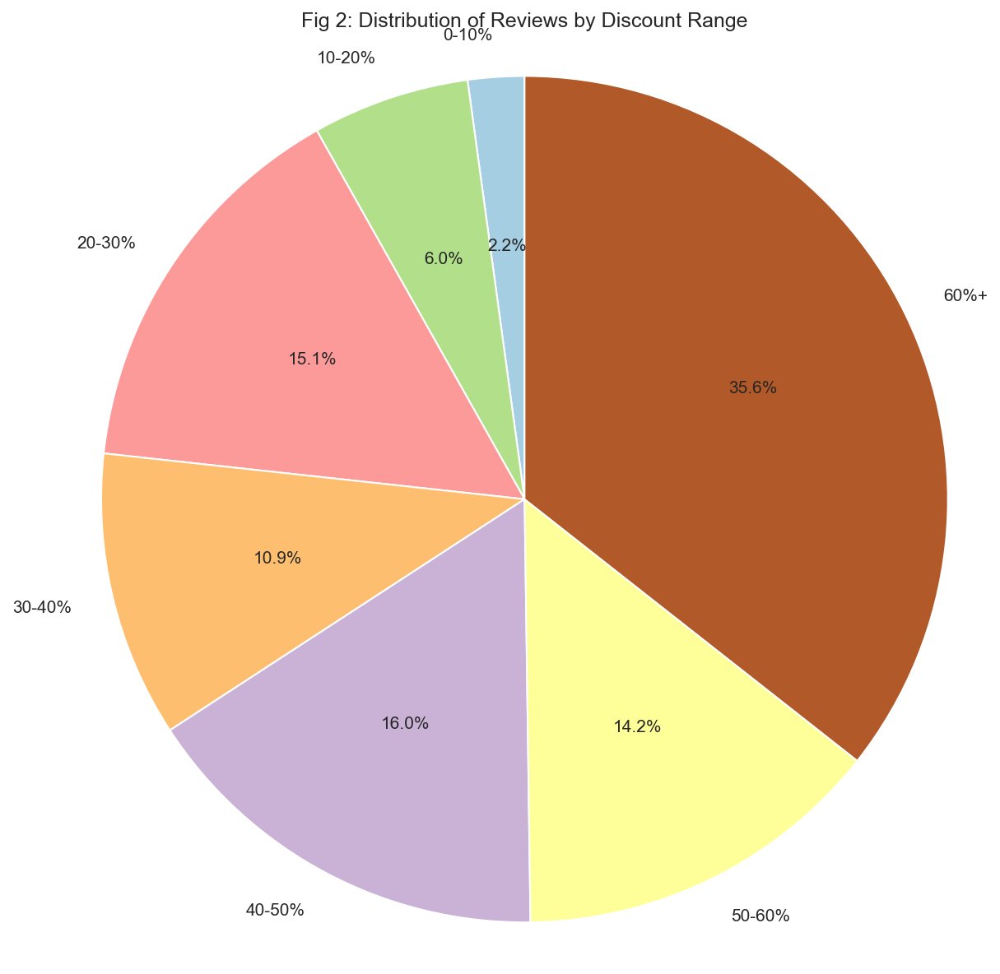
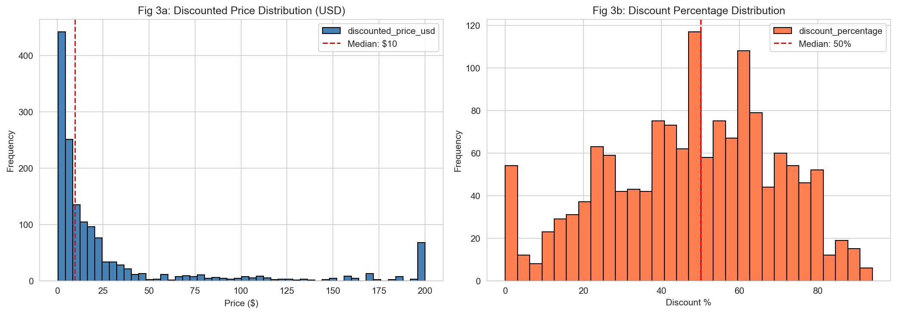
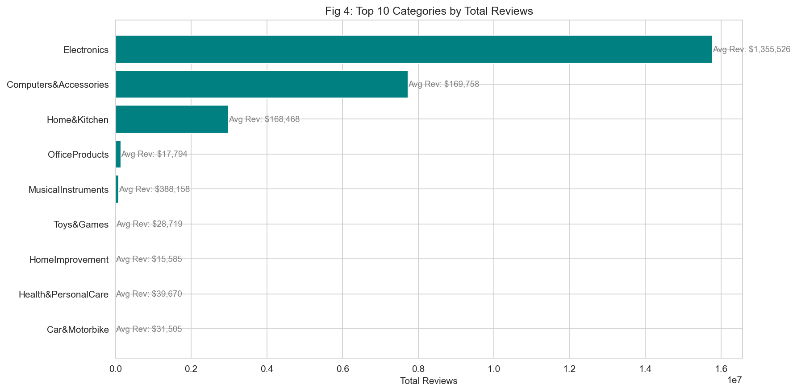
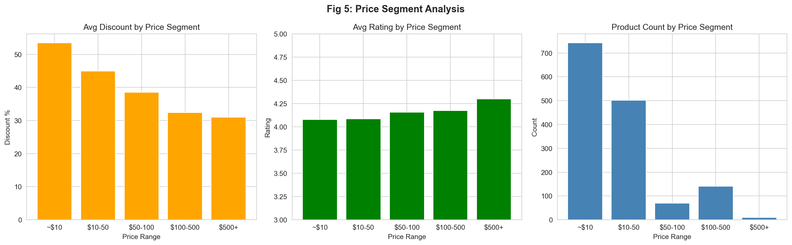
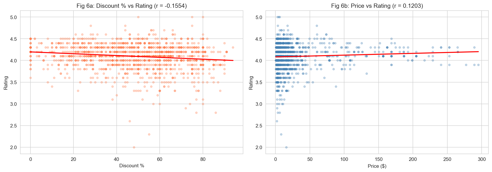
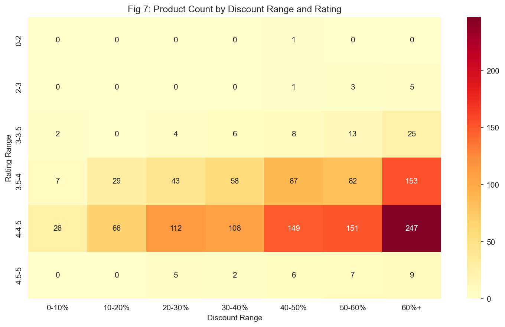
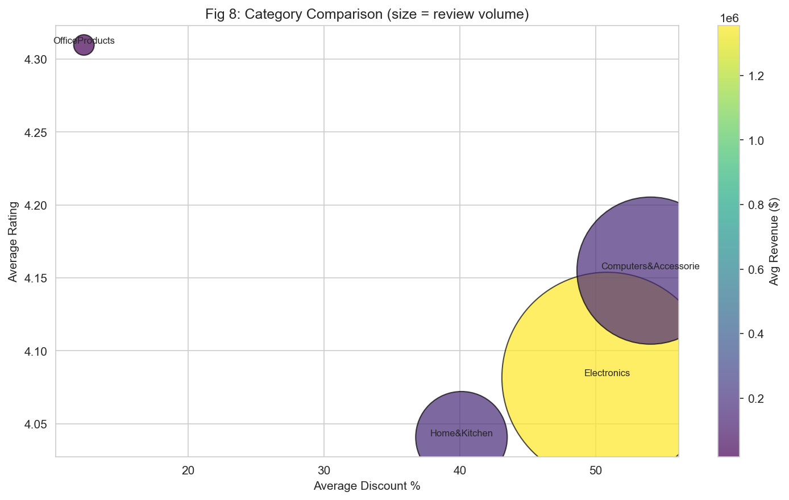
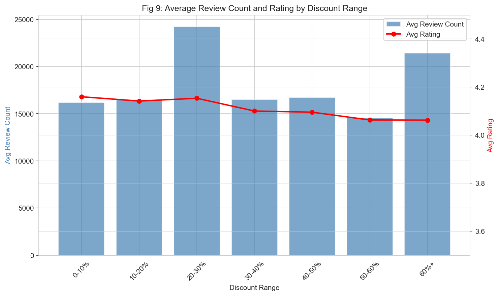

# Amazon Product Discount Effect Analysis

**Sunghun Kim**

## Why I Did This Project

I wanted to understand how discounts actually affect product performance on Amazon. As someone who frequently buys from Amazon, I always wondered: do heavy discounts really lead to more sales? Do cheaper products get rated lower? I found a dataset on Kaggle with 1,465 Amazon India product listings and decided to dig into it.

The main question I wanted to answer was: **What is the relationship between discount rates and revenue, ratings, and purchase volume?**

---

## Dataset

My dataset was found on Kaggle, and the data is from Amazon India product listings. It has 1,465 records with features including product name, category, discounted/actual price, discount percentage, rating, and review count. Since prices were in Indian Rupees (₹), I converted them to USD using an exchange rate of 83 INR = 1 USD.

The dataset was relatively clean. Only a few missing values were found in rating (1) and rating_count (2). I added several new features during preprocessing: price segments, main category extraction, estimated revenue (review count × price), and savings ratio.

---

## Observations

### Revenue by Discount Range (Fig 1)


Products in the 0-10% discount range generate the highest average revenue. This was surprising to me because I expected heavily discounted products to perform better. It turns out that lightly discounted or premium products drive more revenue per unit.

### Review Volume by Discount (Fig 2)


The 60%+ and 40-50% discount ranges attract the most reviews. Since I used review count as a proxy for sales volume, this suggests that deep discounts do drive more purchases, but not more revenue. Interesting trade-off.

### Price and Discount Distributions (Fig 3)


Prices are heavily right-skewed. The median price is only $9.63 while the average is $37.65, meaning most products are cheap but a few expensive items pull the average up. Most products sit in the 40-60% discount range.

### Top Categories (Fig 4)


Electronics dominates the dataset with 15.8M reviews, followed by Computers & Accessories (7.7M) and Home & Kitchen (3.0M). Electronics also has the highest average revenue per product.

### Price Segment Analysis (Fig 5)


I split products into price segments (~$10, $10-50, $50-100, $100-500, $500+) and found that cheaper products get much deeper discounts (53.5% avg for ~$10) compared to expensive ones (31% for $500+). Higher-priced products also have slightly better ratings. This makes sense because expensive products are more likely to be premium quality.

### Correlation Analysis (Fig 6)


I ran correlations between discount, price, rating, and review count:

| Relationship | r value | What it means |
|-------------|:---:|------|
| Discount vs Rating | -0.155 | Weak negative. Higher discounts slightly associate with lower ratings |
| Price vs Rating | +0.120 | Weak positive. Pricier products rate slightly higher |
| Discount vs Reviews | +0.012 | Almost zero. Discount alone does not really drive review count |

None of the correlations were strong, which tells me that discount percentage alone is not a reliable predictor of product performance. There are likely many other factors involved.

### Rating Heatmap (Fig 7)


This heatmap shows product counts across discount ranges and rating ranges. Most products cluster in the 40-60% discount and 4.0-4.5 rating range. Very few products exist in extreme discount or low rating areas.

### Category Bubble Chart (Fig 8)


I compared categories by average discount (x), average rating (y), review volume (bubble size), and revenue (color). Electronics stands out with the highest revenue despite having a moderate rating and discount.

### Rating and Reviews by Discount (Fig 9)


This dual-axis chart shows that review counts peak at the 50-60% discount range, while average ratings stay relatively stable across all discount ranges. Discounting drives volume but does not seem to hurt how people rate the products.

---

## Summary

From this analysis, I learned that:
- Premium-priced, lightly discounted products generate the most revenue per product
- Deep discounts (60%+) drive purchase volume but not revenue
- Discount percentage has weak correlation with ratings, meaning discounting does not really hurt product perception
- Higher-priced products tend to have slightly better ratings
- Electronics is the dominant category across all metrics

If I were to advise a seller, I would say that aggressive discounting helps with visibility and volume, but it does not necessarily maximize revenue. A moderate discount strategy could be more profitable.

---

## Interactive Dashboard

I also built a Streamlit dashboard that lets you filter by category, price range, and rating to explore the data interactively.

```bash
pip install streamlit plotly statsmodels
streamlit run dashboard.py
```

---

## Project Structure

```
Amazon-data-analysis/
├── main.py              # Static analysis (generates 9 figures)
├── dashboard.py         # Streamlit interactive dashboard
├── data_processor.py    # Data loading, cleaning, feature engineering
├── analysis.py          # Analysis functions (correlations, summaries)
├── config.py            # Settings (bins, exchange rate, paths)
├── amazon.csv           # Dataset
├── README.md
└── images/              # Generated visualizations
```

## How to Run

```bash
pip install pandas matplotlib seaborn numpy tabulate
python main.py
```

## Tech Stack
Python, Pandas, NumPy, Matplotlib, Seaborn, Streamlit, Plotly
